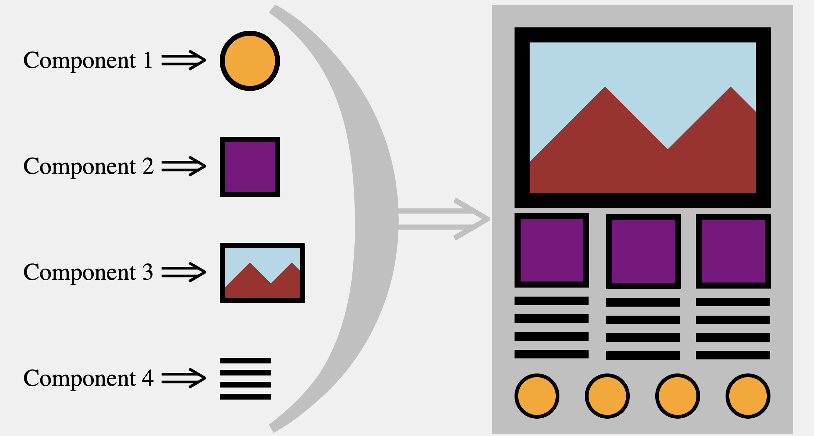
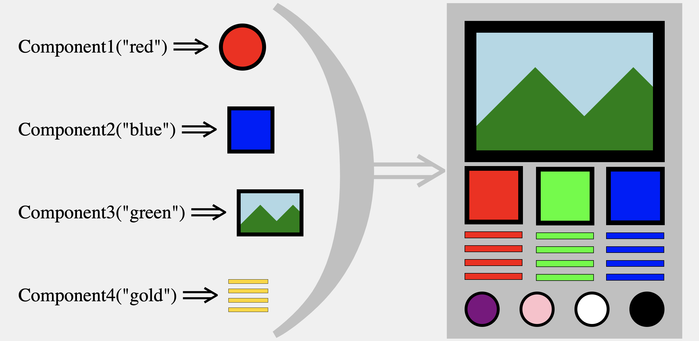

# React Props and Arrays

---

# Passing Properties to Components

---

## Components are dynamic

- Components are functions!

- Functions are re-usable blocks of code

- They also accept arguments...

---

## Components without arguments



---

## Components with arguments



---

## Components with arguments

- Arguments passed to components are called **properties**

- The term properties is usually shorted to **props**

- When you pass a function different arguments it should do or return something different (generalization)

- With components, different **props** means a different return (at least it should)

---

## Passing arguments to a function

```js
console.log("Hello World");

// log is a method of console
// we pass it the string "Hello World"
```

- In js, we pass a function argument(s) between the parentheses when we call it.

- What about in react?

- How do we pass a component arguments...

---

## Passing arguments to a component

- Just like in js, we pass a component arguments when we execute it

- This means we pass props in the **opening tag** of a component in JSX

- Unlike js, we pass components arguments in the form of key value pairings

---

## Passing arguments to a component

```jsx
import ExampleComponent from "./ExampleComponent";

const App = () => {

	return (
		<div>

			<ExampleComponent nameOfProp="valueOfProp" />

			{/* If a value is a string, it can be written regularly */}

		</div>
	)
}
```

- Passing **props** to components looks just like giving attributes in HTML

---

## Passing arguments to a component example

```jsx
// in file App.js
import BigTextComponent from "./BigTextComponent";

const App = () => {
	return (
		<div>
			<p>Here comes some big text</p>
			<BigTextComponent message="Woah, this text is huge!" />
		</div>
	)
}
```

---

## Passing arguments to a component

- If the value of a property is not a string, you have to use an expression slot

- This means you open curly brackets `{ }`

```jsx
import ExampleComponent from "./ExampleComponent";

const App = () => {

	const variable = 42;
	const myAwesomeFunction = () => {
		return false
	};

	return (
		<div>
			<ExampleComponent
				aNumber={-12}
				aBool={true}
				someVariable={variable}
				incomingFunction={myAwesomeFunction}
				notVeryUseful={undefined}
				slightlyMoreUseful={null}
				stringsWorkToo={"Howdy"}
			/>
		</div>
	)
}
```

- Without seeing the component's definition, this may be confusing

- It's coming in a few slides

---

## Passing arguments to a component example

```jsx
// in file App.js
import CoolButton from "./CoolButton";

const App = () => {
	return (
		<div>
			<p>Click the button!</p>
			<CoolButton
				content="Groovy"
				handleClickFunction={ ()=>{ console.log("You clicked that button good!") } }
				color="blue"
			/>
		</div>
	)
}
```

- **props** are passed to components as key value pairings

- This means that components receive them as an object

- This `CoolButton` component receives its **props** as an object as its first parameter

- It is as if we executed it like so:

```js
CoolButton(
	{
		content: "Groovy",
		handleClickFunction: ()=>{ console.log("You clicked that button good!") },
		color: "blue"
	}
)
```

---

- Logical question: how do you handle receiving props?

[topic-2-receiving-properties-in-components](./topic-2-receiving-properties-in-components.md)
