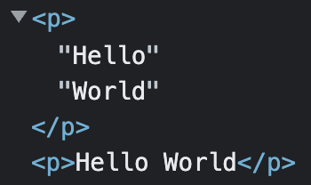

# Making Nodes in JSX
 
---

## Thought experiment

What does this component render?

```jsx
const Test = () => {
	return <p> {"Hello"} </p>
}
```

Is it the same as

```jsx
const Test = () => {
	return <p> Hello </p>
}
```

---

## Finding the answer

```jsx
const Test1 = () => {
	return <p>{`Hello`} {'World'}</p>
}

const Test2 = () => {
	return <p>Hello World</p>
}

const Sandbox = () => {
	return (
		<div>
			<Test1/>
			<Test2/>
		</div>
	)
}
```

- Take a look with the inspector

- Test1 renders two Text Nodes in the `<p>`

- Test2's `<p>` just contains `Hello World` as its content



---

## JSX and expression slots

When JSX sees an expression slot as the content of an element it creates a text node

This is why two adjacent expression slots containing strings look separated by sets of double quotes " "

But, not all expressions produce text nodes.

---

## Game: What does it make?

### numbers

```jsx
const Constant = () => {
	return <p>What will Test render?</p>
}

const Test = () => {
	return <p> I produce: {42} </p>
}
```

```html
<p>
	" I produce: "
	"42"
</p>
```

---

## Game: What does it make?

### undefined

```jsx
const Constant = () => {
	return <p>What will Test render?</p>
}

const Test = () => {
	return <p> I produce: {undefined} </p>
}
```

```html
<p> I produce: </p>
```

---

## Game: What does it make?

### booleans

```jsx
const Constant = () => {
	return <p>What will Test render?</p>
}

const Test = () => {
	return <p> I produce: {true} </p>
}
```

```html
<p> I produce: </p>
```

---

## Game: What does it make?

### null

```jsx live=true
const Constant = () => {
	return <p>What will Test render?</p>
}

const Test = () => {
	return <p> I produce: {null} </p>
}
```

```html
<p> I produce: </p>
```

---

## Game: What does it make?

### functions?

```jsx
const Constant = () => {
	return <p>What will Test render?</p>
}

const Test = () => {
	const myFun = () => {}
	return <p> I produce: {myFun} </p>
}
```

```html
<p> I produce: </p>
```

---

## Game: What does it make?

### functions can work

```jsx
const Constant = () => {
	return <p>What will Test render?</p>
}

const Test = () => {
	const myFun = () => "Hi"
	return <p> I produce: {myFun()} </p>
}
```

```html
<p>
	" I produce: "
	"Hi"
</p>
```

---

## Game: What does it make?

### objects

```jsx
const Constant = () => {
	return <p>What will Test render?</p>
}

const Test = () => {
	return <p> I produce: { {} } </p>
}
```

- The application crashes

---

## objects

`Error: Objects are not valid as a React child`

Objects break JSX pretty bad

It doesn't know what to do with them

You're very likely to see this error in your future

---

## Arrays?

- Arrays get their own topic

---

## Multiple expression slots

- Keep in mind that you may have many adjacent expression slots producing text nodes 

```jsx
const Constant = () => {
	return <p>What will Test render?</p>
}

const Test = () => {
	const fun = () => "this";
	return <p> I produce: {undefined}{"Hello"}{null}{Infinity}{false}{0}{`What is ${fun()} madness?`}{NaN}</p>
}
```

- In general, falsey values are ignored

- 0 is a very notable exception to this

---

[topic-4-arrays-in-jsx](./topic-4-arrays-in-jsx.md)
