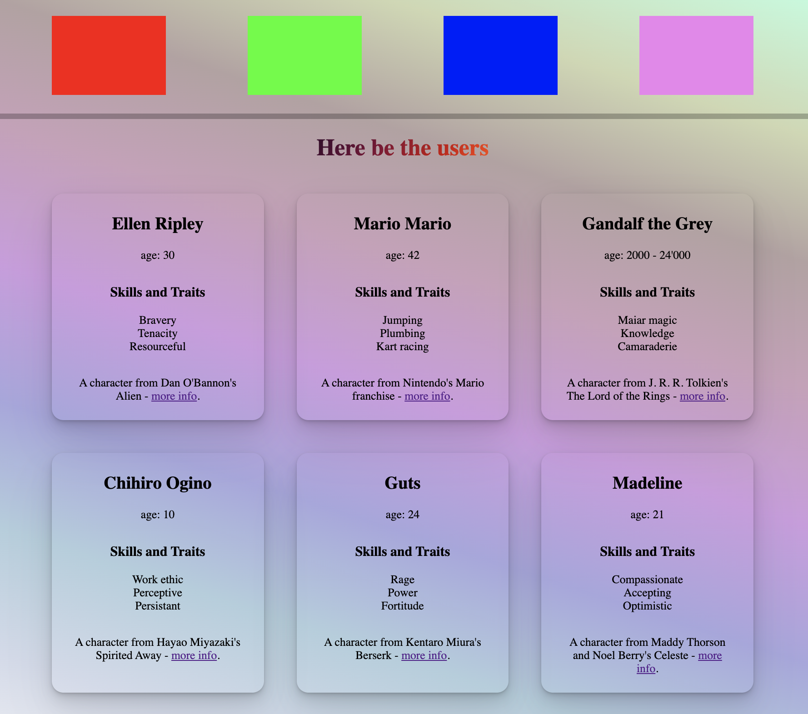

# Exercise 10: Style it up

---

You can choose whether you want to use inline styles or a CSS file.

In either case, make sure each `User` component can be distinguished in the UI from each other user.

Consider removing the list bullets. Box shadows are often used for this purpose instead of colored borders, but it very much depends on the desired aesthetic.

You can find some nice examples of box shadows [here](https://getcssscan.com/css-box-shadow-examples).

If you're looking for vivid background gradients, you can use [Joshua Comeau's gradient generator](https://www.joshwcomeau.com/gradient-generator/).

Whatever choices you make, just be sure the information can still be read.

---

An example result:

[Previous Exercise](./exercise-9.md)

[Back to the README.md](../README.md)

[Next Exercise](./exercise-11.md)
