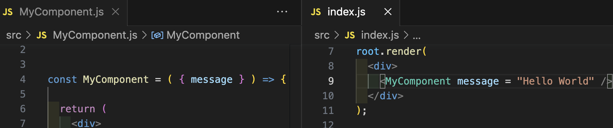

# Exercise 3: Rendering your component

**This exercise will make use of what you saw in Topic 1**

---

### **STEP 1** : render your component

- Open your `src/index.js` file
- `import` your component at the top of the file
- You're currently rendering a `
` with some text in it...
- Replace your text with the JSX execution of your component (remember to execute it as a self-closing HTML element)
- In the browser, use the inspector tool and look around for the DOM element(s) that your component produces
- It may be hard to find because many HTML elements have no `height` in the box model if they don't have content
- If you can find any element your component produces, you can move to Step 2

_Note: It may be the case that your browser crashes when you execute your component without passing it props. If you see an error in the browser's console that looks like:_

`Uncaught TypeError: Cannot read properties of undefined (reading '<your_variable_name>')`

_This crash is most likely because you haven't yet passed your component props, so you should move to Step 2._

---

### **STEP 2** : Pass your component some props

In Step 3 of [exercise-2](./exercise-2.md), you received and used some props in your dynamic component.

Now it is time to provide your component some props.

Since you have to make sure you match the prop name used in your component's definition with the prop name you pass it when you render it, you may be less error prone if you open both files up at the same time. There are several ways to do this, but the easiest is to right click a file and select: "Open to the Side".

Once you see the value of the props you've passed your component change what was rendered, you're done!

If you haven't, consider using `console.log` to figure out what `props` your component is receiving. Don't forget that if you are trying to deconstruct your prop name from the props object, that you will have to open up braces inside the parentheses of the function's parameter list.

Don't forget to clean up your `log`s once you're done testing!

---

### **STEP 3** : render your component multiple times

Your `src/index.js` file should now be rendering a `
` whose content is one execution of your component.

Execute your component three more times in that `div>`.

Provide it with different props each time.

Each time the JSX's return encounters a component, it must execute that function to calculate its return. The different arguments/props you've provided that function have contributed to what it returned.

---

You should see your component rendered in the browser four times - each with a different product.

If you do, exercise-3 is complete 🎉

[Previous Exercise](./exercise-2.md)

[Back to the README.md](../README.md)

[Next Exercise](./exercise-4.md)
