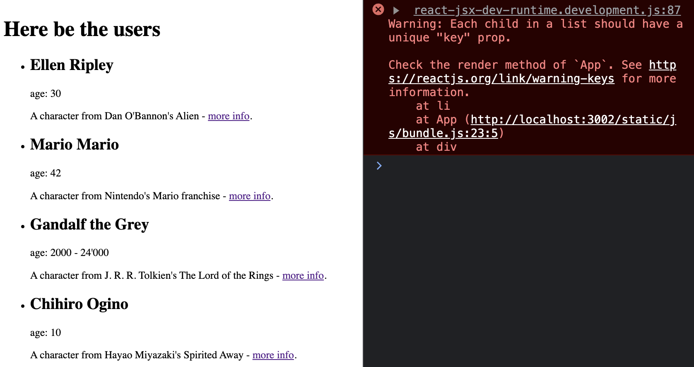

# Exercise 5: Mapping an Array

**This exercise will make use of what you saw in Topic 5**

---

The goal for this exercise is to have the App render a DOM element for each name, age and fiction for each user.

---

### **STEP 1** : clean up App's return

Time to modify the contents of the `<main>` tag.

- Start by removing the placeholder text you gave it
- Place an `<h1>` as its first child
- Give that header some content, examples: "My App" or "The users"

The `<h1>` is a block level element with margin above and below it, this will help visually separate your first four component renders from exercises 2-3.

- Since you're going to be listing out a bunch of users, it makes sense to do so inside a `<ul>`, so make one beneath the header.

---

### **STEP 2** : map through users

You may still have some lingering `console.log`s appearing in your browser. Remove them by deleting or commenting them out from whichever file is producing them. With your browser's console clean:

- Open an expression slot inside the `<ul>`'s content
- Execute the map method from the `users` array
- In the callback function, `console.log` each element
- Since `users` contains 4 elements, you should see 4 logs in your browser's console - each will be an object with the same keys, but different values.

---

### **STEP 3** : map's return

Remember that your map method's callback function needs to return something - otherwise it will return `undefined` on your behalf and nothing will render in the DOM.

- Each `user` should be represented by an `<li>` (since their parent is a `<ul>`)
- Inside that `<li>`, use appropriate HTML elements for each of the following keys in the `user` object
  - name
  - age
  - fiction
  - wiki

You can ignore the CSS for now, and come back to it after you've hit a checkpoint.

If you elect to add CSS before completing a checkpoint, then try not to invest too much time on it as it is not the goal of this workshop.

Without CSS, your browser should look something like this:

_Note: this screen shot was taken just below the 4 elements rendered from exercise 3._

Looks like we're getting a warning...

---

### **STEP 4** : clean your warnings

_Note: it may be the case that you didn't get this warning because you already added a key. If that's the case, then it's time for you to move on to [exercise-6](./exercise-6.md)! 👍._

Every time you call `map` to render elements, you're going to need to add a `key` to avoid this error (as well as other circumstantial bugs that arise without them).

- The `key` must be unique (look through the `user` object to see if you have a suitable piece of data)
- In the `map`'s return, you should only be passing the `key` attribute to one of the elements

One more exercise to hit the first checkpoint: [exercise-6](./exercise-6.md)!

[Previous Exercise](./exercise-4.md)

[Back to the README.md](../README.md)

[Next Exercise](./exercise-6.md)
