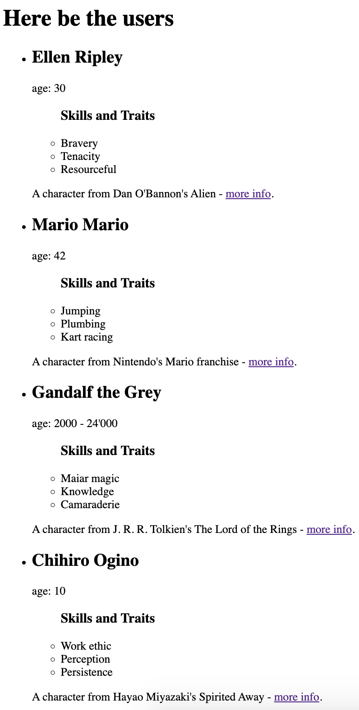

# Exercise 6: Mapping another Array

**This exercise will make use of what you saw in Topic 5**

---

At this point, there should be one key of each `user` object that you haven't used: "skills and traits".

The value of this key is also an array, so you'll need to `map` again to give it representation in the DOM.

---

### **STEP 1** : create a `<ul>`

This new `<ul>` is going to be somewhere inside the `<li>` you built in exercise 5.

Consider putting some header inside this `<ul>` to inform the reader what they're reading.

---

### **STEP 2** : map through "skills and traits" of each user object

Remember to clean up your `console.log`s after you're done testing!

- Open an expression slot inside your new `<ul>`
- Provide the expression that points to the array ¹
- Execute the `map` method
- In the callback function, `console.log` each element
- You should see 12 logged strings in your browser's console (3 for each of 4 users)

¹ If you're struggled with accessing the value of the "skills and traits" key from each user, perhaps a [refresher](./hints/e6h1.md) on object dot notation vs bracket notation would be helpful.

---

### **STEP 3** : produce a `<li>` for each skill/trait

The content of this `<li>` should be the skill or trait.

---

### **STEP 4** : clean your warning and console logs

---

Again, without CSS, your browser should look something like this:

---

🎊 With that done, you've reached the first checkpoint 🎊

[Previous Exercise](./exercise-5.md)

[Back to the README.md](../README.md)

[Next Exercise](./exercise-7.md)
