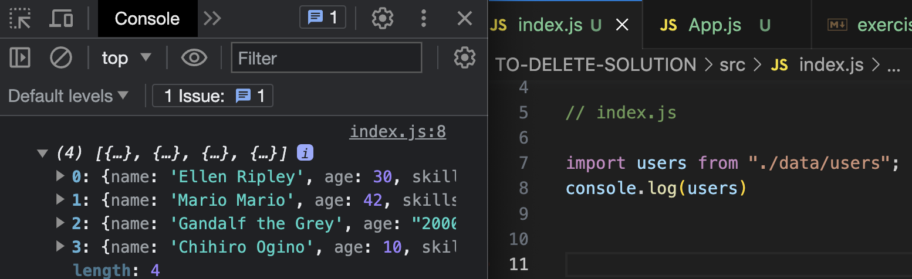

## Having difficulty importing users?

---

Firstly, make sure you are importing in your `index.js` file.

Let's go over the details of imports. Here is an example of an import:

```js
import someVariable from "../../../aFolder/anotherFolder/someFile.js";
```

An import declaration uses two reserved words: `import` and `from`.

An import expect two pieces of information from you:

1. The variable name it is creating in this file
2. The second is a path

When importing a default export, you can choose the variable name. It doesn't have to match the variable name that the exporting file is exporting. In fact, like in `users.js`, a default export doesn't even need to be a named variable.

The path needs to guide the code from the file doing the import, to the file (or folder) being imported. If you begin the path with `./` the source begins in the same folder as the file doing the import (the parent folder). Each time you provide the path `../` the source moves up a folder. If you provide the path `someFolderName/` the source looks deeper into that folder.

At any point you can end the path with a file or folder name: `someFoundFile`. If no file extension is provided, VS Code will assume `.js`. For other file types, you'll need to include the extension after the fileName.

---

In our case, we currently have the following structure:

```
src (folder)
├── components (folder)
│		├── App.js
│		└── SomeComponentYouBuilt.js
├── data (folder)
│		└── users.js
└── index.js
```

The path you provide the import needs to move from `index.js`' parent folder, down into the `data` folder, and finally point to the `users.js` file. So:

1. Start in src folder `./`
2. Look in data folder `data/`
3. Point to the users file `users`

Combining these, the path should look like: `"./data/users"`


